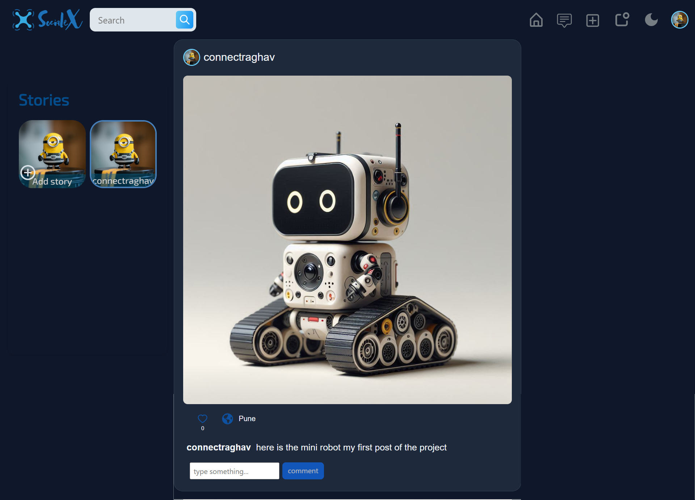
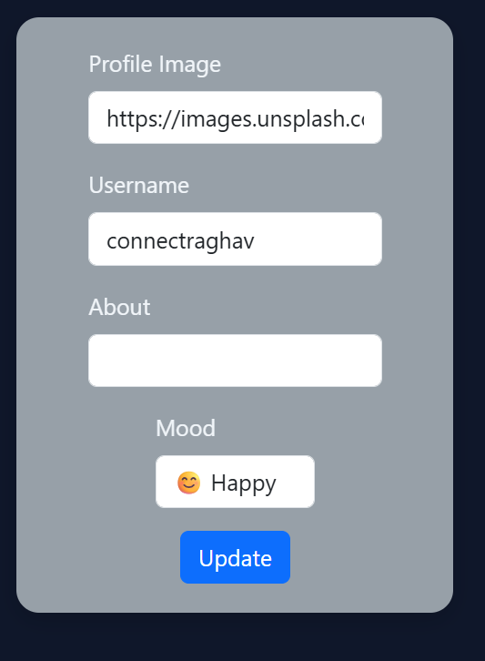
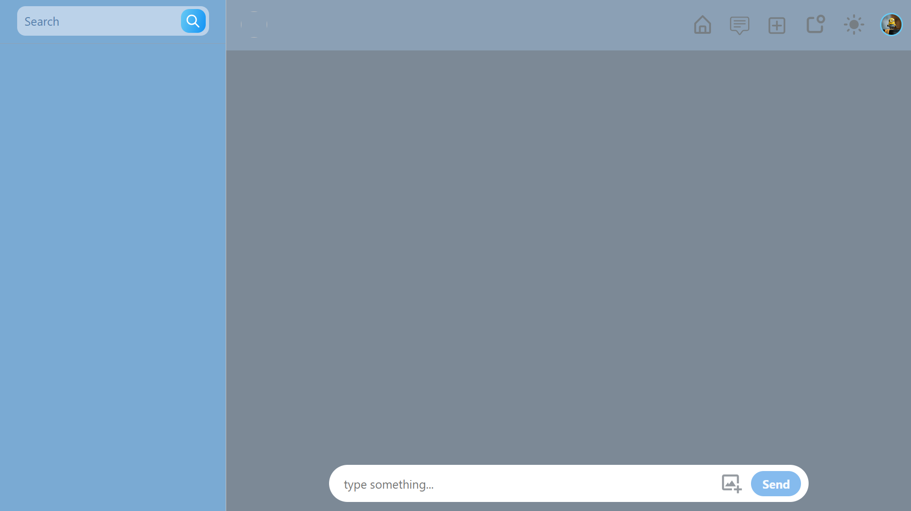
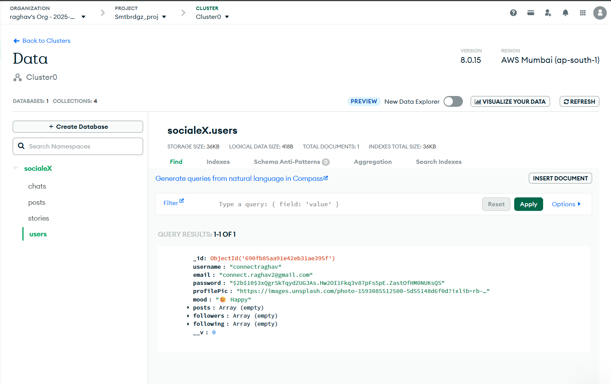

# SocialeX - Modern Social Media Platform

A completely redesigned social media application with a sleek dark theme, built using the MERN stack (MongoDB, Express.js, React, Node.js).

## Features

### Core Features
- **User Authentication**: Secure registration and login with JWT tokens
- **Real-time Chat**: Instant messaging with Socket.io
- **Post Creation**: Share text posts with the community
- **Like System**: Like and unlike posts
- **Follow System**: Follow/unfollow other users
- **Profile Management**: Update profile picture, username, about, and mood
- **Dark Mode Toggle**: Switch between light and dark themes
- **Mood Status**: Set and display your current mood

### New Features Added
- **Completely New UI Design**: Modern dark theme with purple/cyan color scheme
- **Dark Mode Toggle**: Easy theme switching in the navbar
- **Mood Status Feature**: Express your current mood with emojis

## Tech Stack

### Frontend
- **React 18** - Modern React with hooks
- **React Router** - Client-side routing
- **Bootstrap + Custom CSS** - Responsive design
- **Material UI Icons** - Beautiful icons
- **Socket.io Client** - Real-time communication
- **Axios** - HTTP client for API calls

### Backend
- **Node.js** - Server runtime
- **Express.js** - Web framework
- **MongoDB Atlas** - Cloud database
- **Mongoose** - MongoDB object modeling
- **Socket.io** - Real-time bidirectional communication
- **JWT** - JSON Web Tokens for authentication
- **Bcrypt** - Password hashing

### Database
- **MongoDB Atlas** - Cloud-hosted NoSQL database
- **Collections**: Users, Posts, Chats, Stories

## UI Screenshots

### Landing Page

*Modern landing page with authentication forms*

### Home Feed

*Dark theme home feed with posts and navigation*

### Profile Page

*User profile with mood status and edit functionality*

### Chat Interface

*Real-time chat with other users*

### Backend end MongoDB

*Set your current mood in profile settings*

## Database Schema

### MongoDB Collections

#### Users Collection
```javascript
{
  _id: ObjectId,
  username: String,
  email: String,
  password: String (hashed),
  profilePic: String,
  about: String,
  mood: String,
  posts: Array,
  followers: Array,
  following: Array
}
```

#### Posts Collection
```javascript
{
  _id: ObjectId,
  userId: ObjectId,
  username: String,
  profilePic: String,
  desc: String,
  likes: Array,
  createdAt: Date
}
```

### Database Screenshot

*MongoDB Atlas dashboard showing collections and data*

## Getting Started

### Prerequisites
- Node.js (v16 or higher)
- npm or yarn
- MongoDB Atlas account (free tier)

### Installation

1. **Clone the repository**
   ```bash
   git clone <repository-url>
   cd social-media-app
   ```

2. **Install server dependencies**
   ```bash
   cd server
   npm install
   ```

3. **Install client dependencies**
   ```bash
   cd ../client
   npm install
   ```

4. **Set up MongoDB Atlas**
   - Create a free cluster at [MongoDB Atlas](https://www.mongodb.com/atlas)
   - Get your connection string
   - Update `server/index.js` with your connection string

5. **Start the server**
   ```bash
   cd server
   npm start
   ```

6. **Start the client** (in a new terminal)
   ```bash
   cd client
   npm start
   ```

7. **Access the app**
   - Open [http://localhost:3000](http://localhost:3000)

## Project Structure

```
social-media-app/
├── client/                 # React frontend
│   ├── public/
│   ├── src/
│   │   ├── components/     # Reusable components
│   │   ├── context/        # React context providers
│   │   ├── pages/          # Page components
│   │   ├── styles/         # CSS stylesheets
│   │   └── images/         # Static images
├── server/                 # Node.js backend
│   ├── controllers/        # Route controllers
│   ├── models/            # Mongoose models
│   ├── routes/            # API routes
│   └── middleware/        # Custom middleware
└── README.md
```

## API Endpoints

### Authentication
- `POST /register` - User registration
- `POST /login` - User login

### Posts
- `POST /createPost` - Create new post
- `GET /fetchAllPosts` - Get all posts

### Users
- `GET /fetchUserName` - Get user details
- `GET /fetchUserImg` - Get user profile image

## Key Features Explained

### Dark Mode Implementation
- Uses CSS custom properties (variables) for theming
- Theme context provider manages state
- Smooth transitions between themes
- Persists user preference

### Mood Status Feature
- Added to user profile schema
- Dropdown selection with emoji options
- Displays current mood on profile
- Editable in profile settings

### Real-time Features
- Socket.io for instant messaging
- Live updates for likes and follows
- Real-time notifications

## Design System

### Color Palette
- **Primary**: #8B5CF6 (Purple)
- **Secondary**: #06B6D4 (Cyan)
- **Accent**: #F59E0B (Amber)
- **Background**: #0F172A (Dark Blue)
- **Surface**: #1E293B (Slate)
- **Text**: #F1F5F9 (Light Gray)

### Typography
- Modern sans-serif fonts
- Responsive text sizing
- High contrast ratios for accessibility

## Security Features

- **Password Hashing**: bcrypt for secure password storage
- **JWT Authentication**: Token-based authentication
- **Input Validation**: Server-side validation
- **CORS Protection**: Configured for cross-origin requests

## Responsive Design

- Mobile-first approach
- Bootstrap grid system
- Custom breakpoints for tablets and desktops
- Touch-friendly interface elements

## Deployment

### Frontend Deployment
- Build the app: `npm run build`
- Deploy to platforms like Vercel, Netlify, or AWS S3

### Backend Deployment
- Deploy to Heroku, Railway, or AWS EC2
- Set environment variables for production
- Configure MongoDB Atlas for production

## Contributing

1. Fork the repository
2. Create a feature branch
3. Commit your changes
4. Push to the branch
5. Open a Pull Request

## License

This project is licensed under the MIT License - see the LICENSE file for details.

## Acknowledgments

- Original design inspiration
- MERN stack community
- Open source contributors

---

**Built with ❤️ using MERN Stack**
